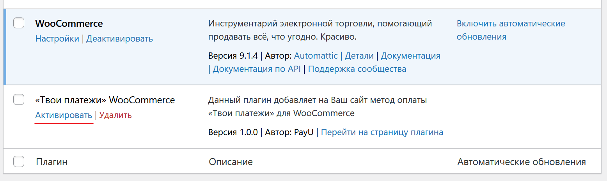
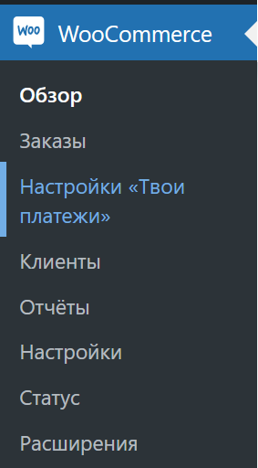

# «Твои платежи», плагин для CMS Wordpress WooCommerce


-------------
## Установка


1. Скопируйте папку payu в папку plugins своего сайта на Wordpress: 
 ```
  {Корень сайта}/wp-content/plugins/
 ```
2. Зайдите в административную консоль своего сайта на Wordpress
3. Через главное меню перейдите "Плагины"
4. Найдите в списке плагин `«Твои платежи» WooCommerce` и активируйте плагин
   
5. Зайдите в настройки плагина WooCommerce > Настройки «Твои платежи»  
   
6. Настройте модуль согласно подсказкам. Не забудьте установить тестовый режим для проверки модуля.

## Ссылки
- [НКО «Твои Платежи»](https://YPMN.ru/)
- [Докуметация API](https://ypmn.ru/ru/documentation/)
- [Тестовые банковские карты](https://ypmn.ru/ru/documentation/#tag/testing)
- [Задать вопрос или сообщить о проблеме](https://github.com/yourpayments/php-api-client/issues/new)

-------------
🟢 [«Твои Платежи»](https://YPMN.ru/ "Платёжная система для сайтов, платформ и приложений") -- финтех-составляющая для сайтов, платформ и приложений